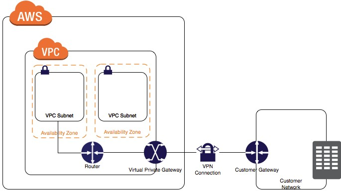

# Practice Exam 2

Topics to review:

1. To login to an EC2 instance use key pairs. To see API calls use access keys.

2. AMIs are a regional resource, if needed in another region, they must be copied over.

3. These are the key reasons to use S3 Standard - IA:
  * It is designed for data that is accessed less frequently
  * It is designed for data that requires rapid access when needed
  * It is ideal for long-term storage, backups, and as a data store for disaster recovery

4. To secure AWS credentials like access keys and secret access keys:
  * Enable MFA
  * Assign an IAM role to the EC2 instance

5. AWS Storage Gateway and Glacier encrypts data at rest by default.

6. Perfect Forward Secrecy is used to offer SSL/TLS cipher suites for CloudFront and ELB. It provies additional safeguards against the eavesdropping of encrypted data, through the use of a unique random session key. This prevents the decoding of captured data, even if the secret long-term key is compromised.

7. You can back up the data on EBS volumes to S3 by creating snapshots of EBS volumes.

8. Key reasons to use EBS:
  * When you create an EBS volume in an Availability Zone, it is automatically replicated within that zone to prevent data loss due to failure of any single hardware component
  * An EBS volume is off-instance storage that can persist independently from the life of an instance
  * EBS volumes support live configuration changes while in production which means that you can modify the volume type, volume size, and IOPS capacity without service interruptions
  * Amazon EBS encryption uses 256-bit Advanced Encryption Standard algorithms (AES-256)

9. Prerequisites for routing traffic to a website hosted in an S3 bucket:
  * The bucket must have the same name as your domain or subdomain
  * A registered domain name
  * Route 53 as the DNS service for the domain

10. Possible event notifications for S3 buckets:
  * SNS
  * SQS
  * Lambda Function

11. You can use Route 53 with failover option to a static S3 website bucket or CloudFront distribution in an event of a load failure.

12. To establish a successful site-to-site VPN an internet-routable IP address (static) of the customer gateway's external interface for the on-premise network will need to be configured. Figure 2-1 depicts how a site-to-site VPN is established.

  
  <h3>Figure 2-1. Site-to-site VPN connection from the customer to the AWS VPC</h3>

13. A bastion host is a special purpose computer on a network specifically designed and configured to withstand attacks. If you have a bastion host in AWS, it is basically just an EC2 instance. It should be in a public subnet with either a public or Elastic IP address with sufficient RDP or SSH access defined in the security group. Users log on to the bastion host via SSH or RDP and then use that session to manage other hosts in the private subnets.

14. Amazon Glacier is used for storing infrequently accessed data and storing data archives.

15. When failing over, Amazon RDS simply flips the canonical name record (CNAME) for your DB instance to point at the standby, which is in turn promoted to become the new primary.

16. Security Groups usually control the list of ports that are allowed to be used by your EC2 instances and the NACLs control which network or list of IP addresses can connect to your whole VPC.

17. To route domain traffic to an ELB load balancer, use Amazon Route 53 to create an alias record that points to your load balancer. An alias record is a Route 53 extension to DNS. It's similar to a CNAME record, but you can create an alias record both for the root domain, such as tutorialsdojo.com, and for subdomains, such as portal.tutorialsdojo.com. Use alias with type "AAAA" or "A" record set.

18. Cold HDD volumes provide low-cost (lowest cost HDD) magnetic storage that defines performance in terms of throughput rather than IOPS. This means Cold HDD volumes are ideal for large, sequential cold-data workloads and data that is infrequently accessed.

19. To increase fault tolerance of the connection to the VPC in the private subnet (VPC peered with another VPC in a public subnet):
  * You can establish a hardware VPN over the internet and the on-premise network
  * Establish another AWS DC connection and a private virtual interface in the same AWS region
  * Note that there is no edge to edge routing in VPC peering (cannot use the public VPC to extend the private VPC in this scenario)

20. You can manage the following in an IAM dashboard:
  * Users
  * Groups
  * Identity Providers
  * Policies

21. The best way to implement a bastion host is to create a small EC2 instance which should only have a security group from a particular IP address for maximum security. We use a small instance rather than a large one because this host will only act as a jump server to connect to other instances in your VPC and nothing else. Hence, there is no point of allocating a large instance simply because it doesn't need that much computing power to process SSH (port 22) or RDP (port 3389) connections.

22. Steps when backing up a database hosted on an EC2 instance backed by EBS volumes configured in a RAID array:
  * Stop all apps from writing to the RAID array
  * Flush all caches to the disk
  * Confirm that the associated EC2 instance is no longer writing to the RAID array by freezing the file system, unmounting the RAID array, and even shutting down the EC2 instance
  * Take a snapshot of each EBS volume in the array only after all disk related activity is stopped

23. You can back up the data on your Amazon EBS volumes to Amazon S3 by taking point-in-time snapshots. Snapshots are incremental backups, which means that only the blocks on the device that have changed after your most recent snapshot are saved. This minimizes the time required to create the snapshot and saves on storage costs by not duplicating data. When you delete a snapshot, only the data unique to that snapshot is removed. Each snapshot contains all of the information needed to restore your data (from the moment the snapshot was taken) to a new EBS volume.

24. EBS facts:
  * When you create an EBS volume in an AZ, it is automatically replicated within that zone to prevent data loss due to failure of any single hardware component
  * EBS volumes are off-instance storage that can persist independently from the life of an instance
  * EBS volumes support live configuration while in production (allows you to modify volume type, size, IOPS capacity, etc.)
  * EBS provides the ability to create snapshots and write a copy of the data to S3

25. Key features of API gateway:
  * You can run multiple versions of the same API
  * You can run your APIs without any servers (Lambda)
  * You pay only for the API calls you receive and the amount of data transferred out

26. EC2 instances with the same auto scaling group behind the ELB are more reachable via URL to the ELB, try attaching an IGW to the VPC and route it to the subnet.

27. Using SWF and SQS can help decouple the architecture for applications which use AWS and on-premise servers.

28. You can use Amazon Data Lifecycle Manager (Amazon DLM) to automate the creation, retention, and deletion of snapshots taken to back up your Amazon EBS volumes.

29. For auto scaling the cooldown period:
  * Is configurable
  * Default value is 5 minutes or 300 seconds
  * Ensures that the auto scaling group does not launch or terminate EC2 instances before the previous scaling activity takes effect

30. A minimal version of an environment always running in the cloud in Disaster Recovery -> Pilot light.
