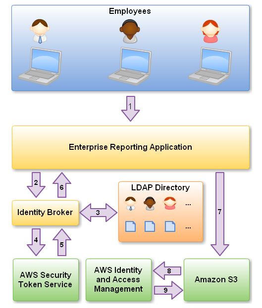

# Practice Exam 4

Topics to review:

1. Require storage service that provides the scale and performance that their big data applications require such as high throughput to compute nodes coupled with read-after-write consistency and low-latency **file** operations -> EFS.

2. Detailed logging and auditing in S3 -> Enable server access logging for all required S3 buckets.

3. In AWS VPC, an instance retains it's private IP addresses when the instance is stopped.

4. Shell scripts to duplicate resources in another region -> AWS CloudFormation.

5. Running an EC2 instance or having EBS volumes attached to stopped EC2 instances will incur a cost.

6. If an instance is in the public subnet (also has same AMI and security group configuration as others) but cannot be accessed from the internet, try assigning an Elastic IP address to the instance.

7. Acts as a firewall that controls the traffic allowed to reach one or more instances -> Security group.

8. Automated way to perform configuration tasks and run start scripts after the instance starts -> User data.

9. If something is being processed twice where required once try using AWS SWF.

10. Basic monitoring metrics from AWS CloudWatch for RDS:
  * Amount of available random access memory
  * Average number of disk I/O operations per second during the polling period
  * Percentage of CPU utilization

11. When you create or update a distribution in Cloudfront, you can add an origin access identity (OAI) and automatically update the bucket policy to give the origin access identity permission to access your bucket. Alternatively, you can choose to manually change the bucket policy or change ACLs, which control permissions on individual objects in your bucket.

Amazon CloudFront only accepts well-formed connections to prevent many common DDoS attacks like SYN floods and UDP reflection attacks from reaching your origin. DDoS attacks are geographically isolated close to the source, which prevents the traffic from affecting other locations. These capabilities can greatly improve your ability to continue serving traffic to end users during larger DDoS attacks. You can use Amazon CloudFront to protect an origin on AWS or elsewhere on the Internet.

12. S3 bucket URL format: < bucket-name >.s3-website-< AWS-region >.amazonaws.com

13. Amazon Athena is an interactive query service that makes it easy to analyze data directly in Amazon Simple Storage Service (Amazon S3) using standard SQL. With a few actions in the AWS Management Console, you can point Athena at your data stored in Amazon S3 and begin using standard SQL to run ad-hoc queries and get results in seconds.

Athena is serverless, so there is no infrastructure to set up or manage, and you pay only for the queries you run. Athena scales automatically—executing queries in parallel—so results are fast, even with large datasets and complex queries.

Athena helps you analyze unstructured, semi-structured, and structured data stored in Amazon S3. Examples include CSV, JSON, or columnar data formats such as Apache Parquet and Apache ORC. You can use Athena to run ad-hoc queries using ANSI SQL, without the need to aggregate or load the data into Athena.

15. Spot instances are terminated by default when interrupted.

16. Minimum size of an object that can be uploaded in a bucket -> 0 byte.

17. EBS statuses:
  * **ok** -> All checks pass
  * **impaired** -> A check fails
  * **insufficient-data** -> Checks in progress

18. Integrating AWS IAM with an on-premise LDAP directory service -> Develop an on-premise custom identity broker app and use STS to issue short-lived AWS credentials.

  
  <h3>Figure 4-1. LDAP Identity Federation AWS IAM Solution</h3>

19. AWS Step Functions provides serverless orchestration for modern applications. Orchestration centrally manages a workflow by breaking it into multiple steps, adding flow logic, and tracking the inputs and outputs between the steps. As your applications execute, Step Functions maintains application state, tracking exactly which workflow step your application is in, and stores an event log of data that is passed between application components. That means that if networks fail or components hang, your application can pick up right where it left off.

20. DynamoDB auto scaling uses the AWS Application Auto Scaling service to dynamically adjust provisioned throughput capacity on your behalf, in response to actual traffic patterns. This enables a table or a global secondary index to increase its provisioned read and write capacity to handle sudden increases in traffic, without throttling. When the workload decreases, Application Auto Scaling decreases the throughput so that you don't pay for unused provisioned capacity.

21. Disaster recovery plan for Redshift during regional outage -> Enable cross-region snapshots copy in AWS Redshift.

22. When failing over RDS flips the CNAME in Route 53 for your DB instance to point to the standby which will become the new primary.

23. Ensuring a fault-tolerant and highly available architecture:
  * EC2 instances placed in different Availability Zones are both logically and physically separated, and they provide an easy-to-use model for deploying your application across data centers for both high availability and reliability
  * Elastic Load Balancers (ELB) allow you to spread load across multiple Availability Zones and Amazon EC2 Auto Scaling groups for redundancy and decoupling of services. It provides high availability such that if one of its Availability Zones failed, it can direct the request to another healthy Availability Zone to avoid any down time

24. AWS X-Ray allows you to trace and analyze user requests as they travel through your API Gateway APIs to the underlying services.

25. You can add multi-factor authentication (MFA) to a user pool to protect the identity of your users.
